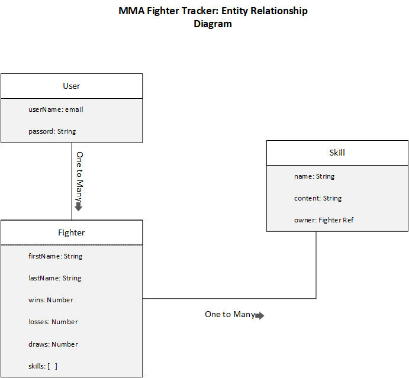

# MMA-Fighter-Tracker-CRUD
MMA Fighter Tracker APP: A simple crud app to track MMA fighters' and their professional records.
Users can add new fighters, as well access, edit, and delete existing fighters. USers also have the option to add skills to existing fighters to match their professional record. 
_________________________________________________________________
## Technologies used:
* Express.JS
* Node.js
* MongoDB
_________________________________________________________________
## Entity Relationship Diagram:

_________________________________________________________________
## Endpoints:

			       ENTITY: USER
			       ------------		

		

|   NAME   |     PATH       |   HTTP VERB     |            PURPOSE                   |
|----------|----------------|-----------------|--------------------------------------| 
| Sign-up  | /Sign-up       |      GET        | Creates new user account             |
| Sign-in  | /Sign-in       |      GET        | Authenticates existing user	     |

			      ENTITY: FIGHTER
			      ---------------

|   NAME      |     PATH       |   HTTP VERB     |            PURPOSE                   |
|----------   |----------------|-----------------|--------------------------------------| 
| indexFighter| /fighters      |      GET        | Displays all existing fighters       |
|createFighter| /fighters      |      POST       | Shows new form for new fighter entry |
| showFighter | /fighters/${id}|      GET        | Shows one specified fighter          |
|updateFighter| /fighters/${id}|      PATCH      | Updates a specific fighter           |
|deleteFighter| /fighters/${id}|      DELETE     | Deletes a specific fighter           |

				ENTITY: SKILL
                                -------------

|   NAME     |                  PATH                   |   HTTP VERB     |            PURPOSE                   |
|----------  |-----------------------------------------|-----------------|--------------------------------------| 
| indexSkills| /fighters/${fighterId}/skills           |      GET        | Displays all existing skills         |
| createSkill| /skills                                 |      POST       | Shows new form for new skill entry   |
| showSkill  | /fighters/${fighterId}/skills/${skillId}|      GET        | Shows one specified skill            |
| updateSkill| /fighters/${fighterId}/skills/${skillId}|      PATCH      | Updates a specific skill             |
| deleteSkill| /fighters/${fighterId}/skills/${skillId}|      DELETE     | Deletes a specific fighter           |
